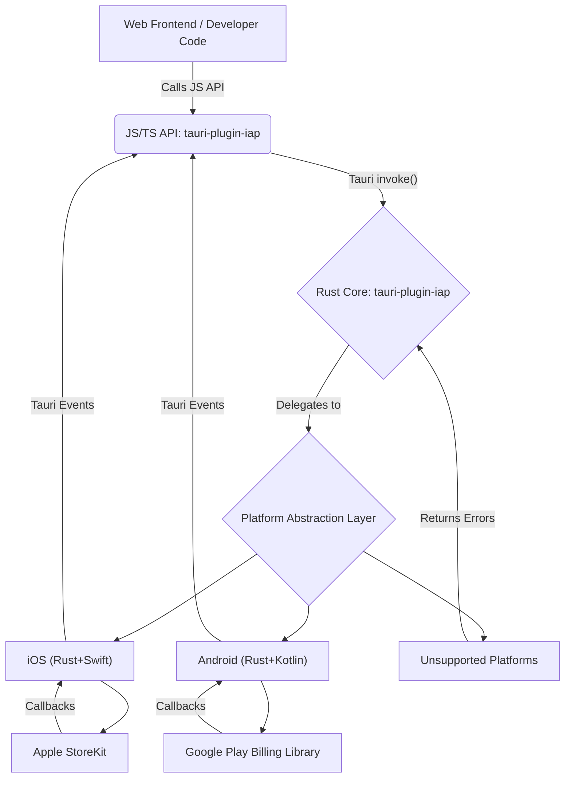

# tauri-plugin-iap

>⚠️ **WORK IN PROGRESS** ⚠️
>_This library is currently under active development and is not yet fully implemented or production-ready. It should be used with caution._

A Tauri plugin to provide a single, unified JavaScript/TypeScript API for developers to implement In-App Purchases (IAP) in a Tauri application, abstracting away the platform-specific native complexities of Apple StoreKit and Google Play Billing.

## Project Goal

The primary goal is to offer a consistent and simplified interface for integrating in-app purchases across different platforms supported by Tauri, specifically iOS and Android.

## Guiding Principles

- **Unified API:** Identical JavaScript API across all platforms.
- **Lean Core:** Rust core acts as a thin, safe bridge.
- **Platform-Specific Modules:** Native code (Swift, Kotlin) and FFI/JNI bindings are isolated.
- **Security First:** Plugin provides secure `receipt`/`token`; server-side validation is mandatory.
- **Clear Error Handling:** Distinct error types for failures.
- **Non-Blocking:** All API calls are asynchronous.

## Overall Architecture

The plugin comprises a JavaScript/TypeScript API package (`tauri-plugin-iap`) for the frontend and a Rust Core crate (`tauri-plugin-iap`) for the backend. Communication flows from the JS API to the Rust Core via Tauri's `invoke` system, and results/events are sent back to the frontend via Tauri's event system.

## Key Features / Unified API Methods

The plugin exposes a set of promise-based, strongly typed JavaScript/TypeScript functions for IAP operations:

- `initialize()`: Initializes the IAP system.
- `isAvailable()`: Checks if IAP services are available on the current platform.
- `queryProductDetails(productIds: string[])`: Retrieves details for specified product IDs.
- `buyNonConsumable(purchaseParam: PurchaseParam)`: Initiates a purchase for a non-consumable product.
- `buyConsumable(purchaseParam: PurchaseParam, autoConsume?: boolean)`: Initiates a purchase for a consumable product.
- `completePurchase(purchase: PurchaseDetails)`: Marks a purchase as complete.
- `restorePurchases(applicationUserName?: string)`: Restores previously made purchases.
- `countryCode()`: Retrieves the country code for the user's store.
- `onPurchaseUpdate(handler: (purchases: PurchaseDetails[]) => void)`: Registers a handler for asynchronous purchase updates.

## Data Models

The plugin uses unified data models for consistency across platforms:

- `ProductDetails`: Information about an in-app product (ID, title, price, currency, etc.).
- `PurchaseDetails`: Details of a completed or pending purchase (purchase ID, product ID, verification data, status, etc.).
- `PurchaseParam`: Parameters required to initiate a purchase.
- `PurchaseStatus`: Enum for purchase states (pending, purchased, error, restored, canceled).
- `PurchaseVerificationData`: Contains local and server-side verification data for a purchase.
- `IAPError`: Standardized error object for IAP failures.
- `ProductDetailsResponse`: Response object for product detail queries, including found products and not-found IDs.

## Platform Support

- **iOS:** Supported via Apple StoreKit, bridged using Rust and Swift (`swift-rs`).
- **Android:** Supported via Google Play Billing Library, bridged using Rust and Kotlin (`jni`).
- **Windows/Linux:** Currently unsupported. IAP-related calls on these platforms will return "PlatformNotSupported" errors.

## Security Considerations

**Server-side validation is mandatory for all purchases.** The client-side should **never** be trusted for purchase verification. The plugin provides `receipt` (Apple) or `purchaseToken` (Google) strings, which **must** be sent to your secure backend server for validation with the respective platform's API verification endpoints. Only after successful server-side validation should the digital good or feature be unlocked.

## Development Roadmap (High-Level)

1.  **Phase 1: iOS Support (MVP)**: Initial setup, Rust core and Swift bridge implementation, basic API, and example app.
2.  **Phase 2: Android Support**: Kotlin implementation, JNI bridge, integration into the core, and extended example app.
3.  **Phase 3: Documentation & Polish**: Comprehensive documentation, refined error handling, robust logging, and thorough testing.

## Usage/Installation

_(To be added in a future update)_

## Contributing

We welcome contributions to `tauri-plugin-iap`! If you're interested in helping improve this plugin, please follow these guidelines:

1.  **Fork and Clone:** Fork the repository and clone it to your local machine.
2.  **Create a Branch:** Create a new branch for your feature or bug fix: `git checkout -b feature/your-feature-name` or `git checkout -b bugfix/issue-description`.
3.  **Make Changes:** Implement your changes, ensuring they adhere to the project's coding standards.
4.  **Test:** Write and run tests to ensure your changes work as expected and don't introduce regressions.
5.  **Commit:** Commit your changes with a clear and concise message.
6.  **Push:** Push your branch to your forked repository.
7.  **Create a Pull Request:** Open a pull request to the `main` branch of the original repository, describing your changes in detail.

### Reporting Issues

If you find a bug or have a feature request, please open an issue on the GitHub repository. Provide as much detail as possible, including steps to reproduce bugs and clear descriptions for feature requests.

### Code of Conduct

Please note that this project is released with a Contributor Code of Conduct. By participating in this project, you agree to abide by its terms.
