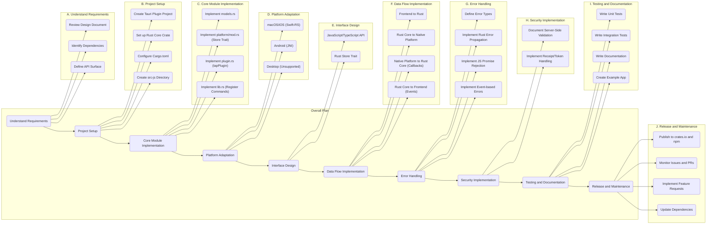

# Implementation Plan: `tauri-plugin-iap` In-App Purchase Plugin

This document outlines the detailed plan for implementing the `tauri-plugin-iap` In-App Purchase plugin, covering all aspects of the design document.

### 1. Project Goal & Guiding Principles

- **Goal:** To provide a single, unified JavaScript/TypeScript API for developers to implement In-App Purchases (IAP) in a Tauri application, abstracting away the platform-specific native complexities of Apple StoreKit and Google Play Billing.
- **Guiding Principles:**
  - **Unified API:** Identical JavaScript API across all platforms.
  - **Lean Core:** Rust core acts as a thin, safe bridge.
  - **Platform-Specific Modules:** Native code (Swift, Kotlin) and FFI/JNI bindings are isolated.
  - **Security First:** Plugin provides secure `receipt`/`token`; server-side validation is mandatory.
  - **Clear Error Handling:** Distinct error types for failures.
  - **Non-Blocking:** All API calls are asynchronous.

### 2. Overall Architecture

The plugin will consist of a JavaScript/TypeScript API package (`tauri-plugin-iap`) and a Rust Core crate (`tauri-plugin-iap`). Communication will flow from the JS API to the Rust Core via Tauri's `invoke` system, and back to the frontend via Tauri's event system.

### 3. Detailed Breakdown:

1.  **Understand Requirements:**

    - 1.1: Thoroughly review the `tauri_plugin_iap_design.md` to internalize the project's goals, guiding principles, and architecture.
    - 1.2: Identify all necessary dependencies for both the Rust core and platform-specific native code (Swift, Kotlin).
    - 1.3: Define the exact API surface for the JavaScript/TypeScript API, including function signatures, data models, and event names.

2.  **Project Setup:**

    - 2.1: Use the Tauri CLI to create a new Tauri plugin project.
    - 2.2: Set up the Rust core crate within the plugin project.
    - 2.3: Configure the `Cargo.toml` file to manage Rust dependencies and features for platform-specific compilation.
    - 2.4: Create the `src-js` directory to house the JavaScript/TypeScript API.

3.  **Core Module Implementation:**

    - 3.1: Implement the `models.rs` file, defining the Rust equivalents of the data structures described in the design document, using `serde` for serialization/deserialization.
    - 3.2: Implement the `platform/mod.rs` file, defining the `Store` trait with the unified interface methods.
    - 3.3: Implement the `plugin.rs` file, containing the `IapPlugin` struct and implementing the Tauri `Plugin` trait, delegating calls to the platform-specific `Store` implementation.
    - 3.4: Implement the `lib.rs` file, the main entry point for the Tauri plugin, responsible for registering commands and setting up the plugin.

4.  **Platform Adaptation:**

    - 4.1: Implement the macOS/iOS support using Rust with `swift-rs` for FFI. This involves writing a Swift class (`StoreKitManager.swift`) to wrap `StoreKit` APIs, generating safe Rust wrappers in `platform/macos.rs`, and configuring `build.rs` to compile the Swift code and link against the `StoreKit.framework`.
    - 4.2: Implement the Android support using Rust with the `jni` crate for JNI. This involves developing a Kotlin class (`BillingManager.kt`) to wrap the Google Play Billing Library, handling JNI interactions in `platform/android.rs`, and updating `build.rs` and Cargo for Android compilation.
    - 4.3: Implement the placeholder implementation for unsupported platforms (Windows/Linux) in `platform/desktop.rs`, returning "PlatformNotSupported" errors for all IAP-related calls.

5.  **Interface Design:**

    - 5.1: Design the JavaScript/TypeScript API in `src-js` with promise-based and strongly typed functions, providing a consistent interface for developers.
    - 5.2: Ensure the Rust `Store` trait defines a common contract for all platform implementations, ensuring a unified internal interface.

6.  **Data Flow Implementation:**

    - 6.1: Implement the data flow from the frontend to Rust using Tauri's `invoke` system.
    - 7.1: Define specific error types (e.g., `PlatformNotSupported`, `InitializationFailed`, `ProductNotFound`, `PurchaseCancelled`, `NetworkError`, `InvalidReceipt`).
    - 7.2: Use Rust's `Result` type to propagate errors from native code through the Rust bridge to the `IapPlugin`.
    - 7.3: Ensure errors returned from Rust `invoke` calls cause the corresponding JavaScript `Promise` to reject.
    - 7.4: Implement event-based errors for asynchronous events like `onPurchaseUpdate`.

7.  **Security Implementation:**

    - 8.1: Document the server-side validation requirement, emphasizing that the client-side should never be trusted for purchase verification.
    - 8.2: Implement the handling of receipt/token strings, ensuring they are sent to the developer's server for validation.

8.  **Testing and Documentation:**

    - 9.1: Write unit tests for the Rust core and platform-specific modules.
    - 9.2: Write integration tests to ensure the plugin works correctly with a Tauri application.
    - 9.3: Write comprehensive documentation covering installation, API usage, error handling, and server-side validation.
    - 9.4: Create a basic example Tauri app to demonstrate the plugin's functionality.

9.  **Release and Maintenance:**
    - 10.1: Publish the plugin to `crates.io` (Rust core) and `npm` (JavaScript/TypeScript API).
    - 10.2: Monitor issues and pull requests on the plugin's repository.
    - 10.3: Implement feature requests and address bug reports.
    - 10.4: Update dependencies regularly to ensure compatibility and security.
