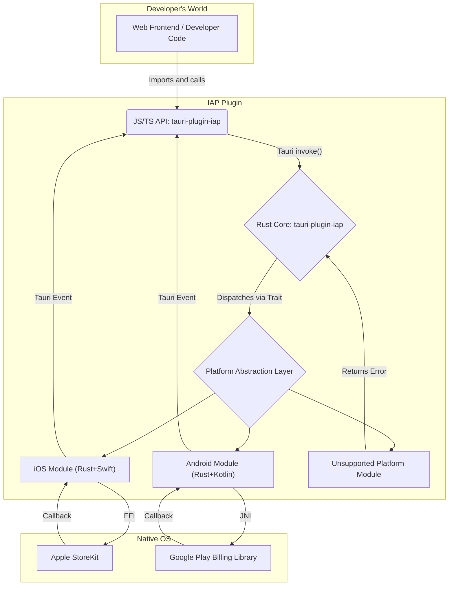

# Detailed Plan: `tauri-plugin-iap` In-App Purchase Plugin

### **1. Project Goal & Guiding Principles**

**Goal:** To provide a single, unified JavaScript/TypeScript API for developers to implement In-App Purchases (IAP) in a Tauri application, abstracting away the platform-specific native complexities of Apple StoreKit and Google Play Billing.

**Guiding Principles:**

- **Unified API:** Identical JavaScript API across all platforms.
- **Lean Core:** Rust core acts as a thin, safe bridge.
- **Platform-Specific Modules:** Native code (Swift, Kotlin) and FFI/JNI bindings are isolated.
- **Security First:** Plugin provides secure `receipt`/`token`; server-side validation is mandatory.
- **Clear Error Handling:** Distinct error types for failures.
- **Non-Blocking:** All API calls are asynchronous.

### **2. Overall Architecture**

The plugin will consist of a JavaScript/TypeScript API package (`tauri-plugin-iap`) and a Rust Core crate (`tauri-plugin-iap`). Communication will flow from the JS API to the Rust Core via Tauri's `invoke` system, and back to the frontend via Tauri's event system.



### **3. Core Module Division**

The plugin follows the official Tauri plugin structure:

```text
tauri-plugin-iap/
├── src/              - Rust implementation
│   ├── commands.rs   - Command definitions for webview
│   ├── desktop.rs    - Desktop implementation
│   ├── error.rs      - Error types
│   ├── lib.rs        - Plugin setup and implementation exports
│   ├── mobile.rs     - Mobile implementation (iOS/Android)
│   └── models.rs     - Shared data structures
├── permissions/      - Command permission files
├── android/         - Android library implementation
├── ios/            - Swift package implementation
├── guest-js/       - JavaScript API source code
├── dist-js/        - Transpiled JavaScript assets
├── Cargo.toml      - Rust crate configuration
└── package.json    - NPM package configuration
```

**3.1. JavaScript/TypeScript API (`/guest-js`)**

This package is distributed via npm and contains the developer-facing API.

#### Unified API Methods (event-driven, cross-platform)

```typescript
export async function initialize(): Promise<void>;
export async function isAvailable(): Promise<boolean>;
export async function queryProductDetails(
  productIds: string[]
): Promise<ProductDetailsResponse>;
export async function buyNonConsumable(
  purchaseParam: PurchaseParam
): Promise<boolean>;
export async function buyConsumable(
  purchaseParam: PurchaseParam,
  autoConsume?: boolean
): Promise<boolean>;
export async function completePurchase(
  purchase: PurchaseDetails
): Promise<void>;
export async function restorePurchases(
  applicationUserName?: string
): Promise<void>;
export async function countryCode(): Promise<string>;
export async function onPurchaseUpdate(
  handler: (purchases: PurchaseDetails[]) => void
): Promise<() => void>;
```

#### Unified Data Models

```typescript
export interface ProductDetails {
  id: string;
  title: string;
  description: string;
  price: string;
  rawPrice: number;
  currencyCode: string;
  currencySymbol: string;
}

export interface PurchaseDetails {
  purchaseID?: string;
  productID: string;
  verificationData: PurchaseVerificationData;
  transactionDate?: string;
  status: PurchaseStatus;
  error?: IAPError;
  pendingCompletePurchase: boolean;
}

export interface PurchaseParam {
  productDetails: ProductDetails;
  applicationUserName?: string;
}

export enum PurchaseStatus {
  pending = "pending",
  purchased = "purchased",
  error = "error",
  restored = "restored",
  canceled = "canceled",
}

export interface PurchaseVerificationData {
  localVerificationData: string;
  serverVerificationData: string;
  source: string;
}

export interface IAPError {
  code: string;
  message: string;
  details?: any;
}

export interface ProductDetailsResponse {
  productDetails: ProductDetails[];
  notFoundIDs: string[];
  error?: IAPError;
}
```

**3.2. Rust Core Crate (`/src-tauri`)**

This is the backend engine, distributed via `crates.io`.

- **`Cargo.toml`**: Manages Rust dependencies and features for platform-specific compilation.
- **`src/lib.rs`**: Main entry point for the Tauri plugin, responsible for registering commands and setting up the plugin.
- **`src/plugin.rs`**: Contains the `IapPlugin` struct and implements the Tauri `Plugin` trait, delegating calls to the platform-specific `Store` implementation.
- **`src/models.rs`**: Rust equivalents of the enhanced data structures above, using `serde` for serialization/deserialization.
- **`src/platform/mod.rs`**: Defines the `Store` trait, now reflecting the unified interface:

```rust
// In src-tauri/src/platform/mod.rs
use tauri::{AppHandle, Runtime, async_runtime::Sender};
use crate::models::{ProductDetails, PurchaseDetails, PurchaseParam, ProductDetailsResponse, IAPError, PurchaseVerificationData, PurchaseStatus};
use anyhow::Result;

pub trait Store: Send + Sync {
    fn initialize(&self, app_handle: AppHandle<impl Runtime>) -> Result<()>;
    fn is_available(&self) -> Result<bool>;
    fn query_product_details(&self, product_ids: Vec<String>) -> Result<ProductDetailsResponse>;
    fn buy_non_consumable(&self, purchase_param: PurchaseParam) -> Result<bool>;
    fn buy_consumable(&self, purchase_param: PurchaseParam, auto_consume: bool) -> Result<bool>;
    fn complete_purchase(&self, purchase: PurchaseDetails) -> Result<()>;
    fn restore_purchases(&self, application_user_name: Option<String>) -> Result<()>;
    fn country_code(&self) -> Result<String>;
    fn on_purchase_update(&self, handler: Box<dyn Fn(Vec<PurchaseDetails>) + Send + Sync + 'static>) -> Result<()>;
}
```

**3.3. Native Platform Code**

- **`ios/`**: Swift package for iOS implementation

  - Wraps StoreKit APIs
  - Handles product fetching, purchases, and transactions
  - Communicates with Rust via FFI

- **`android/`**: Android library implementation

  - Contains Kotlin code for Google Play Billing
  - Manages BillingClient lifecycle
  - Communicates with Rust via JNI

- **`src/desktop.rs`**: Desktop implementation
  - Returns "PlatformNotSupported" for all IAP operations

### **4. Platform Adaptation**

- **iOS (Apple StoreKit):**

  - **Technology:** Rust with `swift-rs` for Foreign Function Interface (FFI).
  - **Native Code:** A Swift class (e.g., `StoreKitManager.swift`) will be written to wrap `StoreKit` APIs. It will handle product fetching, purchase initiation, transaction observation, and receipt retrieval.
  - **Rust Bridge:** `platform/ios.rs` will use `swift-rs` to generate safe Rust wrappers for Swift functions. It will implement the `Store` trait and emit `tauri-plugin-iap://purchase-update` events to the frontend upon successful transactions.
  - **Build:** `build.rs` will compile the Swift code and link against the `StoreKit.framework`.

- **Android (Google Play Billing Library):**

  - **Technology:** Rust with the `jni` crate for Java Native Interface (JNI).
  - **Native Code:** A Kotlin class (e.g., `BillingManager.kt`) will wrap the Google Play Billing Library. It will manage the `BillingClient` lifecycle, query product details, launch billing flows, and listen for purchase updates via `PurchasesUpdatedListener`.
  - **Rust Bridge:** `platform/android.rs` will be the most complex part, handling JNI interactions. It will obtain a `JNIEnv` handle (provided by Tauri's Android support), load the Kotlin `BillingManager` class, create instances, and call its methods. `#[no_mangle]` Rust functions will be defined for Kotlin callbacks to deliver asynchronous results. It will implement the `Store` trait and emit `tauri-plugin-iap://purchase-update` events.
  - **Build:** `build.rs` and Cargo configuration will be set up to correctly bundle the Kotlin code and interface with the Android build system.

- **Windows/Linux (Unsupported):**
  - **Technology:** Pure Rust.
  - **Functionality:** The `platform::desktop` module will implement the `Store` trait by immediately returning a `Result::Err` with a clear "PlatformNotSupported" message for all IAP-related calls.

### **5. Interface Design**

- **JavaScript/TypeScript API:** As detailed in section 3.1.2, the API functions (`initialize`, `getProducts`, `purchase`, `restorePurchases`, `onPurchaseUpdate`) will be promise-based and strongly typed, providing a consistent interface for developers.
- **Rust `Store` Trait:** As detailed in section 3.2.1, the `Store` trait defines the common contract for all platform implementations, ensuring a unified internal interface. Asynchronous operations will be handled using `tauri::async_runtime::Sender` to send results back to the main plugin logic.

### **6. Data Flow**

1.  **Frontend to Rust:**
    - The web frontend calls a JavaScript API function (e.g., `iap.purchase('product_id')`).
    - This JS function uses `await invoke(`${PLUGIN_NAME}::purchase`, { productId });` to send the command and its payload to the Tauri Rust backend.
2.  **Rust Core to Native Platform:**
    - The `IapPlugin` in `plugin.rs` receives the `invoke` command.
    - Based on the detected `target_os`, it delegates the call to the appropriate platform-specific `Store` implementation (e.g., `platform::ios::AppleStore` or `platform::android::GoogleStore`).
    - The platform-specific Rust module then uses FFI (`swift-rs`) or JNI (`jni`) to call the native Swift/Kotlin code.
3.  **Native Platform to Rust Core (Callbacks):**
    - The native Swift/Kotlin code performs the IAP operation (e.g., initiates a purchase, fetches product details).
    - Upon completion (success or failure), the native code uses callbacks (Swift) or JNI callbacks (Kotlin) to return results (e.g., `receipt`, `purchaseToken`, product details, error messages) back to the corresponding Rust bridge module.
    - The Rust bridge module then uses the `result_sender` (from the `Store` trait method) to send the `Result` back to the `IapPlugin`.
4.  **Rust Core to Frontend (Events):**
    - For successful purchases or other asynchronous updates (like subscription renewals), the Rust core will emit a Tauri event (e.g., `tauri-plugin-iap://purchase-update`) using `app_handle.emit_all()`.
    - The JavaScript frontend, which has registered a listener via `onPurchaseUpdate`, receives this event and processes the `Purchase` payload.
    - For direct `invoke` calls (like `purchase()` or `getProducts()`), the Rust command handler will return the `Result` directly, which resolves or rejects the `Promise` on the JavaScript side.

### **7. Error Handling Mechanism**

- **Clear, Distinct Errors:** The plugin will define specific error types (e.g., `PlatformNotSupported`, `InitializationFailed`, `ProductNotFound`, `PurchaseCancelled`, `NetworkError`, `InvalidReceipt`).
- **Rust Error Propagation:** Rust's `Result` type will be used extensively to propagate errors from native code through the Rust bridge to the `IapPlugin`. The `anyhow` crate can simplify error handling across different modules.
- **JS Promise Rejection:** Errors returned from Rust `invoke` calls will cause the corresponding JavaScript `Promise` to reject, allowing developers to use `try-catch` blocks.
- **Event-based Errors:** For asynchronous events like `onPurchaseUpdate`, if an error occurs during the native processing that prevents a valid `Purchase` object from being formed, the event payload might include an error field, or a separate error event could be emitted (e.g., `tauri-plugin-iap://purchase-error`). The initial design suggests `onPurchaseUpdate` only for successful purchases, implying direct `purchase()` call rejections handle errors. This will be clarified during implementation.

### **8. Security Mandate: Server-Side Validation**

This is a critical aspect and will be heavily emphasized in all documentation and examples.

1.  When the JavaScript frontend receives a `Purchase` object (either from the `purchase()` promise resolution or the `onPurchaseUpdate` event).
2.  The `purchase.receipt` (Apple) or `purchase.purchaseToken` (Google) string **must** be immediately sent to the developer's own secure backend server.
3.  The developer's server is then responsible for validating this receipt/token with the respective Apple App Store or Google Play Developer API verification endpoints.
4.  **Only after successful server-side validation** should the digital good or feature be unlocked for the user. The client-side should **never** be trusted for purchase verification.

### **9. Development Roadmap**

1.  **Phase 1: iOS Support (MVP)**

    - Set up the basic Tauri plugin project structure using the CLI.
    - Implement core data structures in `src/models.rs`.
    - Create the Swift package in `ios/` for StoreKit integration.
    - Implement mobile bridge in `src/mobile.rs` for iOS.
    - Define commands in `src/commands.rs`.
    - Build the JavaScript API in `guest-js/`.
    - Create a basic example Tauri app to test iOS IAP functionality.
    - Publish `v0.1.0` with iOS support only.

2.  **Phase 2: Android Support**

    - Create Android library in `android/` for Google Play Billing.
    - Implement Kotlin `BillingManager` and JNI bridge.
    - Update `src/mobile.rs` with Android support.
    - Configure Android build settings in `Cargo.toml`.
    - Extend the example Tauri app to test Android IAP functionality.
    - Publish `v0.2.0` with Android support.

3.  **Phase 3: Documentation & Polish**
    - Write comprehensive documentation covering installation, API usage, error handling, and **especially** the server-side validation requirement.
    - Create detailed example projects for both iOS and Android.
    - Refine error messages and ensure consistent error handling across platforms.
    - Implement robust logging for debugging purposes.
    - Conduct thorough testing on both platforms.
    - Address any remaining issues and prepare for a stable release.
